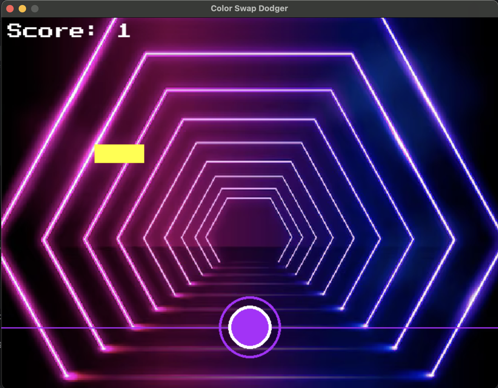

# 🎮 Color Swap Dodger

> A fast-paced, neon-themed reflex game built with Python & Pygame

---

## 🕹️ Game Summary

**Color Swap Dodger** is an addictive color-matching reflex game where you control a glowing orb that can swap between 4 vibrant neon shades.  
Your goal? Match the orb's color with falling blocks by pressing `SPACE` — or it’s Game Over!

Built as a arcade-style game with features:
- Dynamic obstacles
- Vibrant neon visuals
- Sound effects & music
- Main menu, pause, and restart support

---

## 📸 Screenshot



---

## 🎮 Controls

| Key | Action                        |
|-----|-------------------------------|
| `SPACE` | Switch player color       |
| `P`     | Pause / Resume game       |
| `R`     | Restart after Game Over   |
| `ENTER` | Start game from menu      |
| `ESC`   | Quit game (via window)    |

---

## 🚀 How to Run

### 🐍 Method 1: From Source (Python)

#### 🔧 Requirements:
- Python 3.8+
- `pygame` installed

#### 📦 Setup:
```bash
pip install pygame
